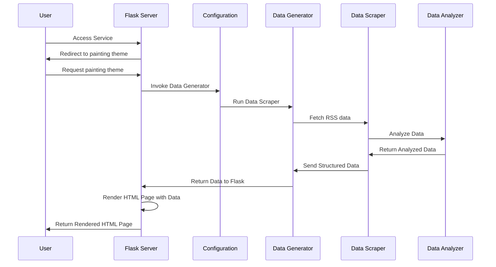
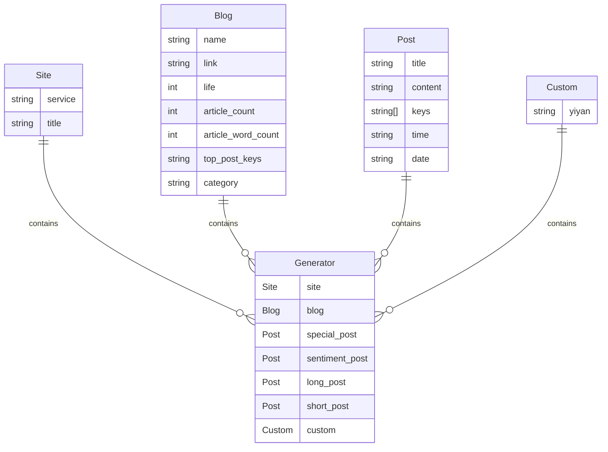

# EndOfYear

EndOfYear 点燃个人博客的年度辉煌！


## 用法

### 要求

- **RSS 源务必输出文章全部内容**，否则数据分析不准确。
- Github 运行可能无法访问 RSS 源，请使用本地 Docker 运行。
- 如果生成年度报告，请结合博客实际情况**设置 RSS 输出文章数量。**

### Github

1.  Fork 项目到个人仓库。
2. 手动配置仓库的 Workflow permissions 设置为 **Read and write permissions**，否则无法写入 html 分支。
    1. 导航到 **Settings**（设置）选项卡。
    2. 在左侧导航栏中，点击 **Actions**（操作）。
    3. 在 **General**（常规）页面下滑，找到 **Workflow permissions**（工作流权限）。
    4. 在 **Workflow permissions** 中，选择 **Read and write permissions**（读写权限）。
    5. 最后点击 **Save**（保存）。
3. 在仓库首页打开目录下的 `config.ini` 配置文件，点击右上角工具栏的 **🖋️（钢笔）** 图标，在线编辑文件。
    - `web`：默认为 true，Github 运行需要配置为 `false` 静态网站模式。
    - `rss`：配置为 RSS 源地址。

```ini
[default]
web = false

[blog]
rss = https://blog.7wate.com/rss.xml
```

4. 点击右上角的 **Commit changes** 提交到 `main` 分支，会自动运行 Actions。
5. 等待 Actions 运行成功，将会部署静态网站文件至 `html` 分支。
6. 开启 GitHub 仓库的 Pages 功能，设置 `html`分支，默认为根目录。
7. 稍等访问个人网址，就可以看到啦~

### Docker

1. 拉取 [endofyear](https://hub.docker.com/r/sevenwate/endofyear) 最新镜像。

```shell
docker pull sevenwate/endofyear:latest
```

2. 映射容器 7777 端口至宿主机端口，指定 `rss` 环境变量，然后运行 Docker。

```shell
# 请将 https://blog.7wate.com/rss.xml 替换为自己的 RSS 地址。
docker run -p 7777:7777 --env rss=https://blog.7wate.com/rss.xml sevenwate/endofyear:latest
```

3. 访问网址 `localhost:7777`

## Q&A

### Github Actions 运行失败

请查阅 Actions 的第六步输出的 Log 日志排错。

### Docker 运行无法访问 Web 服务

1. 请检查**容器映射端口**至宿主机。
2. 请检查是否配置 **rss 环境变量**。
3. 请查看 Docker **运行日志**。

### 博客数据分析不准确

目前博客的数据分析已经相对丰富，准确，未来会结合 AI 进行分析。

### 主题不够丰富

个人时间有限，不过目前可以**保证每年更新一款默认主题**，希望给各位的写作之路带来快乐 ~

## 流程

EndOfYear 通过 RSS 获取博客文章数据，对文章数据进行统计、分析和整理，最终输出为 HTML，客观地反映了博客一年的写作情况。



1. 用户访问 Flask 服务。
2. Flask 根路由跳转 painting 主题。
3. Config 模块运行数据生成器（Generator）。
4. Generator 模块运行数据抓取器（Scraper）来获取RSS数据。
5. Scraper 将抓取的数据结合（Analyzer）对数据进行分析。
6. Analyzer 将分析后的数据返回给 Scraper。
7. Generator 整理（Scraper）结构化数据后将其返回给 Flask。
8. Flask 使用（Generator）的数据渲染 HTML 页面。
9. Flask 返回渲染后的 HTML 页面给用户。

## 主题开发

EndOfYear 使用 Python 结合 Flask 利用 Jinja2 模板进行数据渲染，目前提供四个数据模型。



如果进行主题开发可以使用 Jinja2 的模板语言，结合下面的数据定制一款专属主题。

| 数据           | 描述           |
| -------------- | -------------- |
| site           | 站点数据       |
| blog           | 博客数据       |
| special_post   | 特殊日期文件   |
| sentiment_post | 情感分最高文章 |
| long_post      | 篇幅最长文章   |
| short_post     | 篇幅最短文章   |
| custom         | 自定义数据     |

如果有额外数据需求，可以修改 `custom` 模型，并在 `main.py` 中传参，最后在 HTML 模板中使用。以下是一个简单的模板示例： 

```html
<!DOCTYPE html>
<html lang="zh">
<head>
    <meta charset="UTF-8">
    <title>{{ site.title }}</title>
</head>
<body>
    亲爱的{{ blog.name }}
</body>
</html>
```

## 路线图

EndOfYear 目前处于初始阶段，如果您有兴趣，可以为其做出贡献。计划路线如下：

###  V1

- [x] 结合互联网公开博客的数据源对 EndOfYear 进行全面、规模性的测试。
- [x] 默认主题进一步细化数据分析维度和数据颗粒度，精准描绘用户画像。
- [x] EndOfYear 渲染数据的规范，约束主题开发，提高主题的兼容性。
- [ ] 剥离主题，提供更好地主题开发方式。

###  V2

- [ ] 进一步丰富和完善主题。
- [ ] EndOfYear 项目展示首页，使用文档，主题开发等。
- [ ] 实现轻量化的运行部署，一键运行。
- [ ] 探索以插件的方式附加到博客系统的方法。


## 协议

EndOfYear 采用 GPL 3.0 协议。
