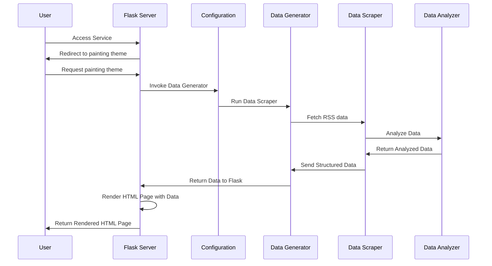
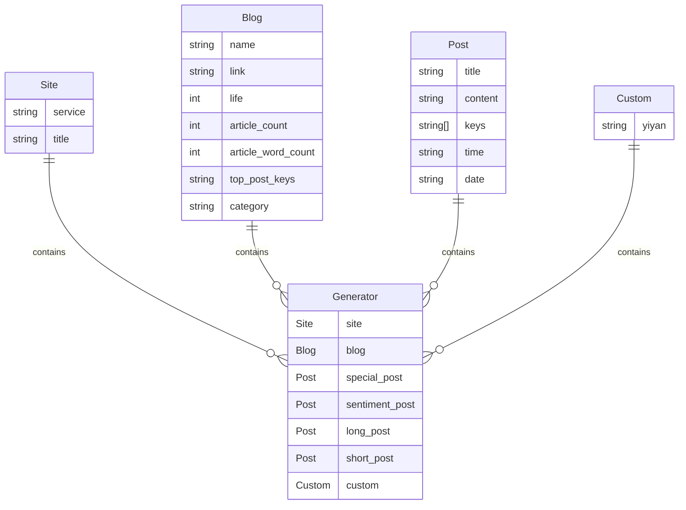

# EndOfYear

EndOfYear 点燃个人博客的年度辉煌！


## 使用方法

### 要求

- **确保 RSS 源提供完整的文章内容**：为了保证数据分析的准确性，RSS 源需要输出文章的全部内容。
- **在 GitHub 上运行**：由于 GitHub 运行环境可能无法访问某些 RSS 源，请考虑在本地 Docker 环境中运行。
- **适当设置 RSS 文章数量**：如果您的目的是生成年度报告，请根据博客的实际情况调整 RSS 输出的文章数量。

### 在 GitHub 上的使用步骤

1. 将项目 Fork 到您的个人仓库。

2. 在仓库首页，找到并打开 `config.ini` 文件。点击右上角的 🖋️ 符号进行在线编辑。

    - `web` 字段：将其**设置为 `false` 以启用静态网站模式**（适用于 GitHub 运行）。
    - `rss` 字段：填写您的 RSS 源地址，确保源地址提供全文输出。

    ```ini
    [default]
    web = false
    
    [blog]
    rss = https://blog.7wate.com/rss.xml
    ```

3. 编辑完成后，点击页面右上角的 **Commit changes** 将更改提交到 `main` 分支。

4. 提交后，GitHub Actions 会自动运行并生成静态网站文件，最终推送至 `html` 分支。

5. 在 GitHub 仓库的 Settings 中开启 Pages 功能，并将源设置为 `html` 分支的根目录。

6. 稍后访问 GitHub Pages 分配的网址，即可看到生成的内容。

### 使用 Docker

1. **拉取 Docker 镜像**：从 [endofyear](https://hub.docker.com/r/sevenwate/endofyear) Docker Hub 页面拉取最新镜像。

    ```shell
    docker pull sevenwate/endofyear:latest
    ```

2. **运行 Docker 容器**：映射容器的 7777 端口到宿主机的端口，并设置 `rss` 环境变量。

    ```shell
    # 将 RSS 地址替换为您自己的。
    docker run -p 7777:7777 --env rss=https://blog.7wate.com/rss.xml sevenwate/endofyear:latest
    ```

3. **访问本地网站**：在浏览器中访问 `localhost:7777`，即可查看结果。

## Q&A

### Github Actions 运行失败

请首先检查 Actions 日志的第六步输出，这里包含了导致运行失败的详细错误信息。

### Docker 运行无法访问 Web 服务

如果在使用 Docker 时无法访问 Web 服务，请按照以下步骤进行故障排除：

1. **检查端口映射**：确保您已正确设置容器的端口映射到宿主机。
2. **确认 rss 环境变量**：请检查是否已正确配置 `rss` 环境变量。
3. **查看 Docker 日志**：如果以上步骤均无法解决问题，请查看 Docker 容器的运行日志以获取更多信息。

### 博客数据分析不准确

目前提供的博客数据分析功能已经相对完善且准确。未来，我计划结合 AI 进一步优化分析效果，以提供更精准的数据维度。

### 主题不够丰富

由于个人时间有限，目前**我仅能承诺每年末前更新一款主题。**尽管如此，我仍然致力于为您的写作之旅带来愉悦和丰富的体验，并感谢您的理解和支持！

## 流程

EndOfYear 通过 RSS 获取博客文章数据，对文章数据进行统计、分析和整理，最终输出为 HTML，客观地反映了博客一年的写作情况。



1. 用户访问 Flask 服务。
2. Flask 根路由跳转 painting 主题。
3. Config 模块运行数据生成器（Generator）。
4. Generator 模块运行数据抓取器（Scraper）来获取RSS数据。
5. Scraper 将抓取的数据结合（Analyzer）对数据进行分析。
6. Analyzer 将分析后的数据返回给 Scraper。
7. Generator 整理（Scraper）结构化数据后将其返回给 Flask。
8. Flask 使用（Generator）的数据渲染 HTML 页面。
9. Flask 返回渲染后的 HTML 页面给用户。

## 主题开发

EndOfYear 使用 Python 结合 Flask 利用 Jinja2 模板进行数据渲染，目前提供四个数据模型。



如果进行主题开发可以使用 Jinja2 的模板语言，结合下面的数据定制一款专属主题。

| 数据             | 描述      |
|----------------|---------|
| site           | 站点数据    |
| blog           | 博客数据    |
| special_post   | 特殊日期文件  |
| sentiment_post | 情感分最高文章 |
| long_post      | 篇幅最长文章  |
| short_post     | 篇幅最短文章  |
| custom         | 自定义数据   |

如果有额外数据需求，可以修改 `custom` 模型，并在 `main.py` 中传参，最后在 HTML 模板中使用。以下是一个简单的模板示例： 

```html
<!DOCTYPE html>
<html lang="zh">
<head>
    <meta charset="UTF-8">
    <title>{{ site.title }}</title>
</head>
<body>
    亲爱的{{ blog.name }}
</body>
</html>
```

## 路线图

EndOfYear 目前处于初始阶段，如果您有兴趣，可以为其做出贡献。计划路线如下：

###  V1

- [x] 结合互联网公开博客的数据源对 EndOfYear 进行全面、规模性的测试。
- [x] 默认主题进一步细化数据分析维度和数据颗粒度，精准描绘用户画像。
- [x] EndOfYear 渲染数据的规范，约束主题开发，提高主题的兼容性。
- [x] 进一步丰富和完善主题。

###  V2

- [ ] 剥离主题，提供更好地主题开发方式。
- [ ] EndOfYear 项目网站首页，使用文档，主题开发等。
- [ ] 实现轻量化的运行部署，一键运行。
- [ ] 探索以插件的方式附加到博客系统的方法。


## 协议

EndOfYear 采用 GPL 3.0 协议。
