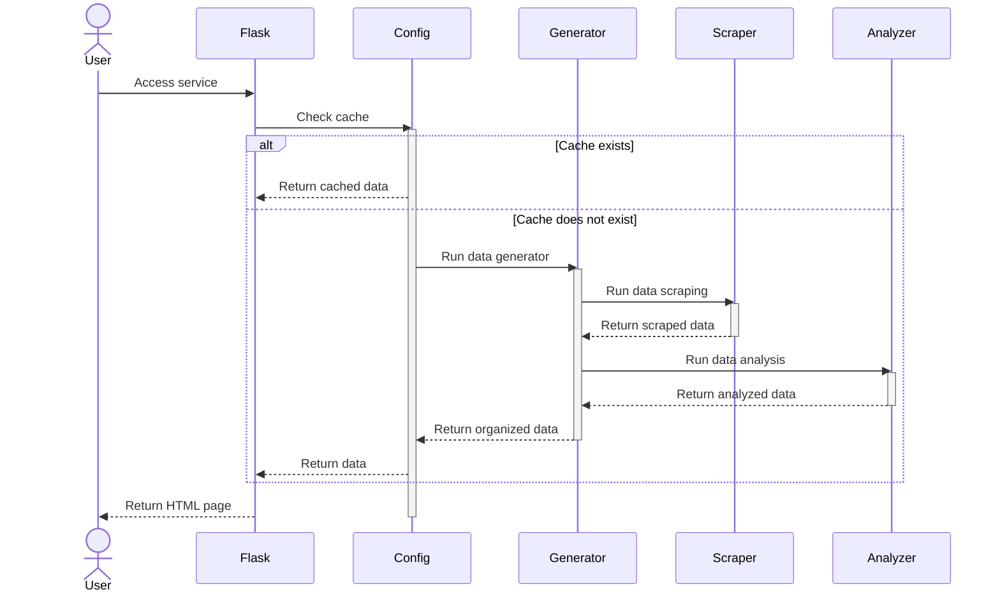

# EndOfYear

EndOfYear 点燃个人博客的年度辉煌！


## 流程

EndOfYear 通过 RSS 获取博客文章数据，对文章数据进行统计、分析和整理，最终输出为 HTML，客观地反映了博客一年的写作情况。



1. 用户访问 Flask 服务。
2. Flask 检查缓存是否存在。
    - 如果缓存存在，Flask直接返回缓存数据。
    - 如果缓存不存在，继续下一步。
3. Config 模块运行数据生成器（Generator）。
4. Generator 模块运行数据抓取器（Scraper）来获取RSS数据。
5. Scraper 将抓取的数据返回给 Generator。
6. Generator 运行数据分析器（Analyzer）对数据进行分析。
7. Analyzer 将分析后的数据返回给 Generator。
8. Generator 整理结构化数据后将其返回给 Flask,Config 模块。
9. Flask 使用整理后的数据渲染 HTML 页面。
10. Flask 返回渲染后的 HTML 页面给用户。

## 用法

### Github

1.  Fork 项目到个人仓库
2. 手动配置仓库的 Workflow permissions 设置为 **Read and write permissions**，否则无法写入 html 分支。
    1. 导航到 **Settings**（设置）选项卡。
    2. 在左侧导航栏中，点击 **Actions**（操作）。
    3. 在 **General**（常规）页面下滑，找到 **Workflow permissions**（工作流权限）。
    4. 在 **Workflow permissions** 中，选择 **Read and write permissions**（读写权限）。
    5. 最后点击 **Save**（保存）。
3. 在仓库首页打开目录下的 `config.ini` 配置文件，点击右上角工具栏的 **🖋️（钢笔）** 图标，在线编辑文件。
    - `web`：配置为 `false`。
    - `rss`：配置为 RSS 地址。

```ini
[default]
web = false

[blog]
rss = https://blog.7wate.com/rss.xml
data =
```

4. 点击右上角的 **Commit changes** 提交到 `main` 分支，会自动运行 Action。
5. 等待 Action 运行成功，将会部署静态网站文件至 `html` 分支。

6. 开启仓库的 Pages 功能，默认为根目录。
7. 访问个人网址，就可以看到啦~

### Docker

1. 拉取最新镜像

```shell
docker pull sevewate/endofyear:latest
```

2. 指定 `rss_url` 环境变量，运行 Docker。请将 `https://blog.7wate.com/rss.xml` 替换为自己的 RSS 地址。

```shell
docker run -p 7777:7777 --env rss=https://blog.7wate.com/rss.xml sevewate/endofyear:latest
```

3. 访问网址 `localhost:7777`

## 路线图

EndOfYear 目前处于初始阶段，如果您有兴趣，可以为其做出贡献。计划路线如下：

###  V1

- [ ] 对博客系统的数据源进行全面、规模性的测试。
- [ ] 进一步细化数据分析维度和数据颗粒度，精准描绘用户画像。
- [ ] 渲染数据的规范，约束主题开发，提高主题的兼容性。

###  V2

- [ ] 丰富和完善主题。
- [ ] 实现轻量化的运行部署，一键运行。
- [ ] 探索以插件的方式附加到博客系统的方法。


## 协议

EndOfYear 采用 GPL 3.0 协议。
